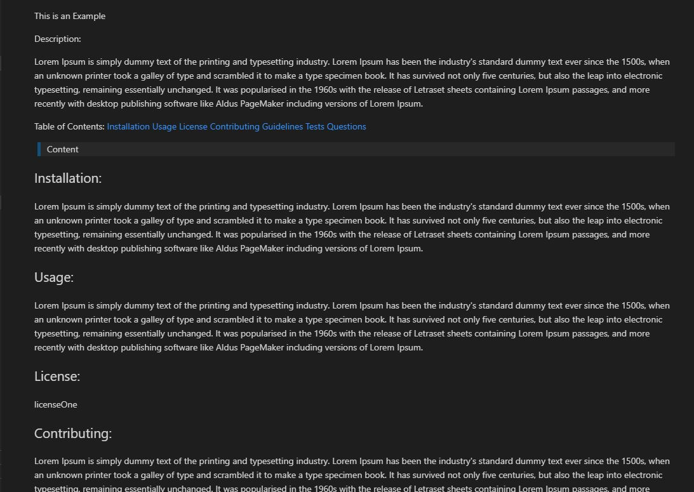

Readme Generator
This Command line App lets a user create a Read me with a pre-set templet by entering their informationthrough the command line. The user can can inintiate the the template by entering node index.js in the command line. 

